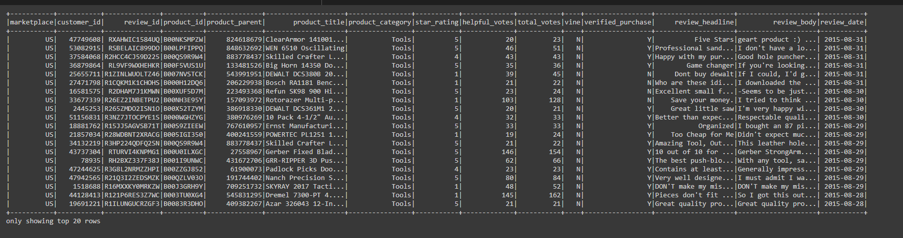
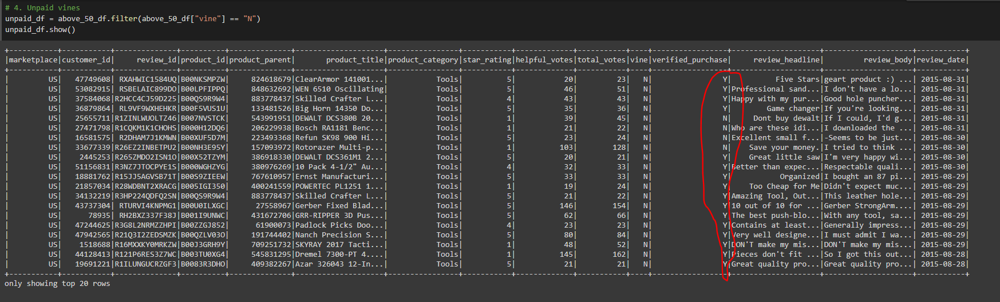

# Amazon_Vine_Analysis
An exploration in big data for Amazon, using PySpark, PgAdmin and Google Colab. 

## Overview
The purpose of this exploration is to determine the difference between Amazon Vine reviews and the non-Vine reviews. In our experiment, we chose to work with the "Tools" category of reviews. The Amazon Vine program is a service that allows manufacturers and publishers to receive reviews for their products. Our target objective is to see whether or not paying for Vine increases the percentage of 5-star reviews for a product.

### Technologies Used:
- PySpark (Python library)
- Google Colab
- PgAdmin

## Results

Before we break down our results, let us understand the data. The Amazon reviews data from the "Tools" category was filtered for review total_votes to be greater than 20, and the percentage of helpful votes (helpful_votes / total_votes * 100) had to be greater than 50. From this filtered dataset, we took the Vine and non-Vine reviews to compare their ratings. Before we split the data into Vine and non-Vine, this is what the data looked like: 

  After splitting the data, we tested to solve the following questions:
### 1. How many Vine reviews and non-Vine reviews were there?
After filtering through the "Tools" category data to get reviews with more than 20 votes and over 50% of votes being helpful, there were 285 Vine reviews, while there were 31,545 non-Vine reviews. This makes sense since Vine is a paid program - we'd expect to have less people participate and more people choose the "free" route.
 

### 2. How many Vine reviews were 5 stars? How many non-Vine reviews were 5 stars?
Of the Vine reviews, 163 were 5-stars. The non-Vine reviews had 14,614 reviews that were 5-stars.

### 3. What percentage of Vine reviews were 5 stars? What percentage of non-Vine reviews were 5 stars?
From our calculations, there were 57.19% of Vine reviews being 5-star ratings. Of the non-Vine however, there were only 46.33% 5-star ratings of the non-Vine reviews. 

 
Full statistics from the console are included below:
 

## Summary

## Possible positivity bias
The largest issue with the current dataset could quite possibly be its positivity bias. A positivity bias is the inclination for people to review more postive versions of the reality they experienced. People act differently when put in the public eye, and this may have been a contributing factor here. Since more people were obliged to review the products with the Vine program, customers who would have been generally satisfied but not review were forced to put some review in place. On the other side of this experiment, the non-Vine reviews most likely contained more of a negativity bias, since an upset customer would be more likely to make a review than a satisfied customer. This could skew the data towards the negative side, given that customers in the non-Vine program aren't required to review.

 However, one point that stood out the most was the paid aspect of this. The fact that the program contains many "non-verified" purchases shows that there may not have been any costs associated with the reviews in the Vine program. 

In the non-Vine DataFrame, we can see that there is a good spread of verified vs. non-verified purchases. 

However, in the Vine DataFrame, there is a consistency of non-verified purchases, meaning that the products being reviewed may have been given out for free or at least at no cost to the customer reviewing the product. 

Assuming the customers in the non-Vine group all had to pay for their products, the expectations must be a lot higher than the Vine program which may or may not provide free samples. A way to test for this could be by comparing the data between verified and non-verified purchases, and seeing how this relates to the vine vs. non-vine data. 